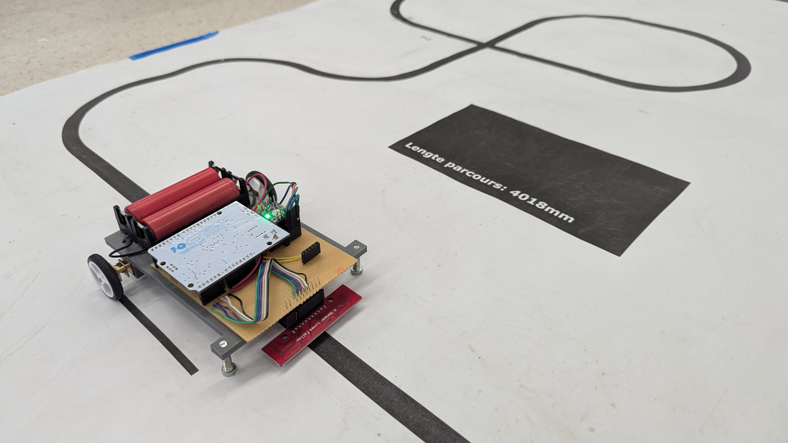

# LineFollower

  
## specifications

microcontroller: Arduino leonardo

motors: 30:1

h-bridge: DRV8833

sensors: HY-S301

batteries: 2x18650

wireless communication: HC-05

distance sensor - motors: +- 15cm

weight: ?

speed: 0,7m/s

